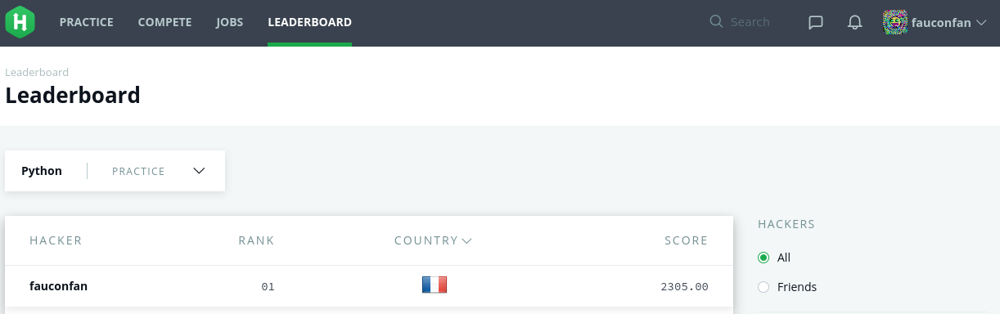

# HackerRank-Python

Here, you can find my version of the python challenges on HackerRank



All challenges were made in the month of January 2018.  
Except 'Bebugging'. Is was made in the month of February 2020.  

Here some links:
 - [HackerRank link](https://www.hackerrank.com/domains/python/)
 - [Doc Python](https://docs.python.org/3/library/index.html)

Tree on directory. (All folders contains a main.py file, they are not listed below)

```
$> tree . --dirsfirst | grep -v main.py
.
├── 01_Introduction
│   ├── Arithmetic Operators
│   ├── Loops
│   ├── Print Function
│   ├── Python: Division
│   ├── Python If-Else
│   ├── Say "Hello, World" With Python
│   └── Write a function
├── 02_Basic Data Types
│   ├── Finding the percentage
│   ├── Find the Runner-Up Score!
│   ├── List Comprehensions
│   ├── Lists
│   ├── Nested Lists
│   └── Tuples
├── 03_Strings
│   ├── Alphabet Rangoli
│   ├── Capitalize
│   ├── Designer Door Mat
│   ├── Find a string
│   ├── Merge the Tools!
│   ├── Mutations
│   ├── String Formatting
│   ├── String Split and Join
│   ├── String Validators
│   ├── sWAP cASE
│   ├── Text Alignment
│   ├── Text Wrap
│   ├── The Minion Game
│   └── What's Your Name?
├── 04_Sets
│   ├── Check Strict Superset
│   ├── Check Subset
│   ├── Introduction to Sets
│   ├── No Idea!
│   ├── Set .add()
│   ├── Set .difference() Operation
│   ├── Set .discard(), .remove() & .pop()
│   ├── Set .intersection() Operation
│   ├── Set Mutations
│   ├── Set .symmetric_difference() Operation
│   ├── Set .union() Operation
│   ├── Symmetric Difference
│   └── The Captain's Room
├── 05_Math
│   ├── Find Angle MBC
│   ├── Integers Come In All Sizes
│   ├── Mod Divmod
│   ├── Polar Coordinates
│   ├── Power - Mod Power
│   ├── Triangle Quest
│   └── Triangle Quest 2
├── 06_IterTools
│   ├── Compress the String!
│   ├── Iterables and Iterators
│   ├── itertools.combinations()
│   ├── itertools.combinations_with_replacement()
│   ├── itertools.permutations()
│   ├── itertools.product()
│   └── Maximize It!
├── 07_Collections
│   ├── collections.Counter()
│   ├── Collections.deque()
│   ├── Collections.namedtuple()
│   ├── Collections.OrderedDict()
│   ├── Company Logo
│   ├── DefaultDict Tutorial
│   ├── Piling Up!
│   └── Word Order
├── 08_Date and Time
│   ├── Calendar Module
│   └── Time Delta
├── 09_Errors and Exceptions
│   ├── Exceptions
│   └── Incorrect Regex
├── 10_Classes
│   ├── Class 2 - Find the Torsional Angle
│   └── Classes: Dealing with Complex Numbers
├── 11_Built-Ins
│   ├── Any or All
│   ├── Athlete Sort
│   ├── ginortS
│   ├── Input()
│   ├── Python Evaluation
│   └── Zipped!
├── 12_Python Functionals
│   ├── Map and Lambda Function
│   ├── Reduce Function
│   └── Validating Email Addresses With a Filter
├── 13_Regex and Parsing
│   ├── Detect HTML Tags, Attributes and Attribute Values
│   ├── Group(), Groups() & Groupdict()
│   ├── Hex Color Code
│   ├── HTML Parser - Part 1
│   ├── HTML Parser - Part 2
│   ├── Introduction to Regex Module
│   ├── Matrix Script
│   ├── Re.findall() & Re.finditer()
│   ├── Regex Substitution
│   ├── Re.split()
│   ├── Re.start() & Re.end()
│   ├── Validating and Parsing Email Addresses
│   ├── Validating Credit Card Numbers
│   ├── Validating phone numbers
│   ├── Validating Postal Codes
│   ├── Validating Roman Numerals
│   └── Validating UID
├── 14_XML
│   ├── XML 1 - Find the Score
│   └── XML2 - Find the Maximum Depth
├── 15_Closures and Decorators
│   ├── Decorators 2 - Name Directory
│   └── Standardize Mobile Number Using Decorators
├── 16_Numpy
│   ├── Array Mathematics
│   ├── Arrays
│   ├── Concatenate
│   ├── Dot and Cross
│   ├── Eye and Identity
│   ├── Floor, Ceil and Rint
│   ├── Inner and Outer
│   ├── Linear Algebra
│   ├── Mean, Var, and Std
│   ├── Min and Max
│   ├── Polynomials
│   ├── Shape and Reshape
│   ├── Sum and Prod
│   ├── Transpose and Flatten
│   └── Zeros and Ones
├── 17_Debugging
│   ├── Default Arguments
│   └── Words Score
├── LICENSE
├── photo_ranking.png
└── README.md

132 directories, 118 files
```
